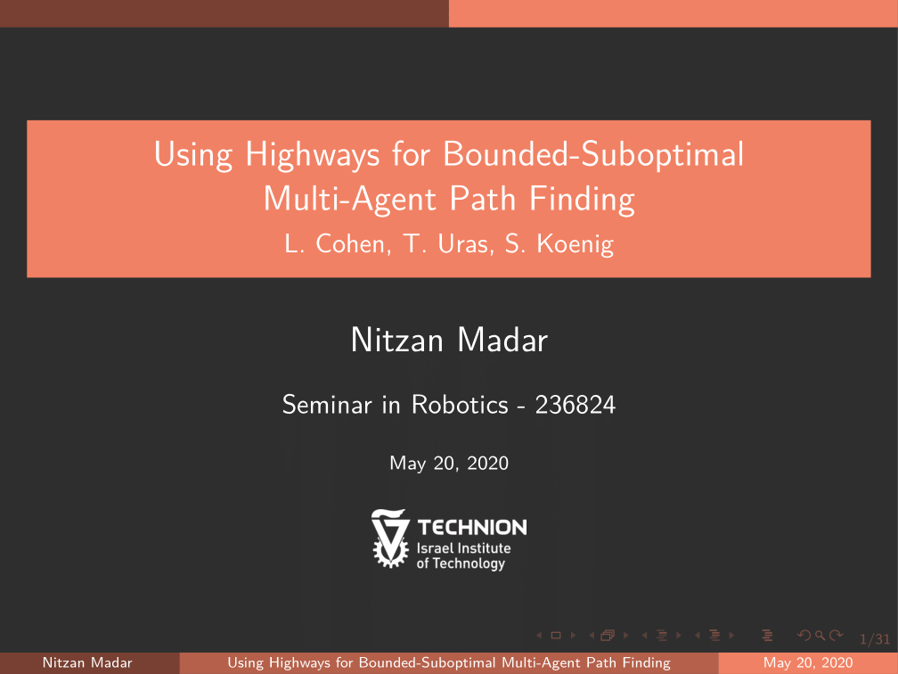

MAPF Seminar
---
This repository contains:
- CBS Project.
- Report on "E-graphs: Bootstrapping Planning With Experience Graphs".
- Seminar presentation on "Using Highways for Bounded-Suboptimal Multi-Agent Path Finding". See title below.

References
---
- Sharon, G., Stern, R., Felner, A., & Sturtevant, N. R. (2015). Conflict-based search for optimal multi-agent pathfinding. Artificial Intelligence, 219, 40-66.
- Cohen, L., Greco, M., Ma, H., Hernández, C., Felner, A., Kumar, T. S., & Koenig, S. (2018, July). Anytime Focal Search with Applications. In IJCAI (pp. 1434-1441).
- Cohen, L., Uras, T., Kumar, T. S., Xu, H., Ayanian, N., & Koenig, S. (2016, January). Improved Solvers for Bounded-Suboptimal Multi-Agent Path Finding. In IJCAI (pp. 3067-3074).
- Cohen, L., Uras, T., & Koenig, S. (2015, May). Feasibility study: Using highways for bounded-suboptimal multi-agent path finding. In International Symposium on Combinatorial Search (Vol. 6, No. 1).
- Barer, M., Sharon, G., Stern, R., & Felner, A. (2014, July). Suboptimal variants of the conflict-based search algorithm for the multi-agent pathfinding problem. In Seventh Annual Symposium on Combinatorial Search.
- Jansen, M. R. J. M. R., & Sturtevant, N. (2008). Direction maps for cooperative pathfinding. In Proceedings of the AAAI Conference on Artificial Intelligence and Interactive Digital Entertainment (Vol. 4, No. 1, pp. 185-190).
- Phillips, M., Cohen, B., Chitta, S., & Likhachev, M. (2012, July). E-graphs: Bootstrapping planning with experience graphs. In International Symposium on Combinatorial Search (Vol. 3, No. 1).